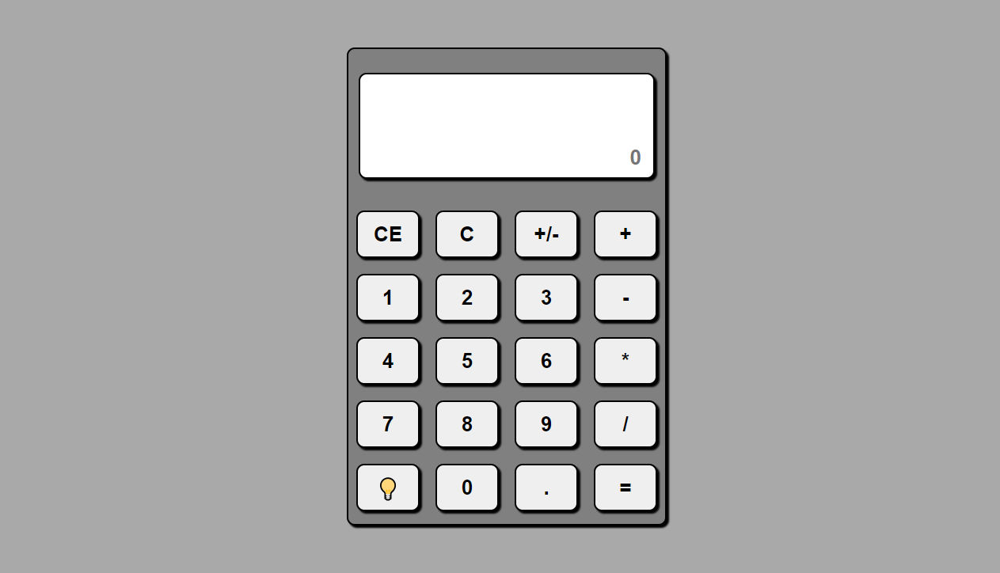

# Calculator App

It is a simple calculator app with basic math functions and theme toggle. 
You can use both the keyboard and the mouse to enter data into the calculator.

## ⭐️ Features 

* Addition
* Subtraction
* Multiplication
* Division
* Dark theme

## [🚀 Link](https://aligatoree.github.io/Calculator/)

## 🔧 Built With

* HTML
* CSS
* JavaScript

### Screenshots

